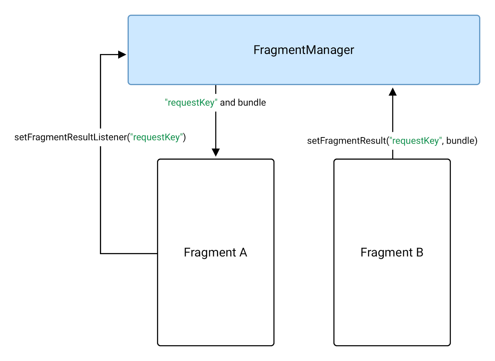
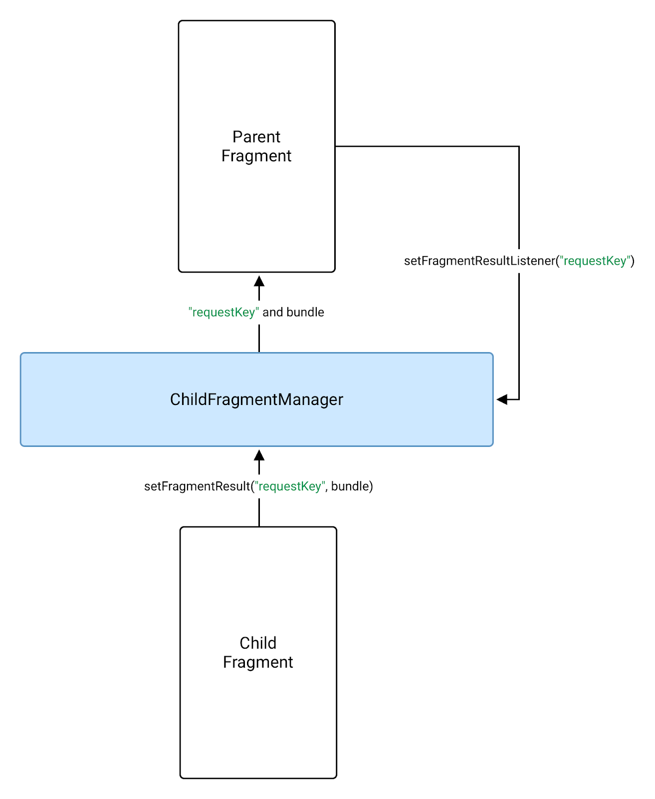

# Communicate with fragments

## Share data using a ViewModel

#### Share data with the host activity

- Both host activity and fragment need to retrieve **shared instance of View model by passing activity scope to view model provider**, so both components can access and modify the view-model data
```java
public class MainActivity extends AppCompatActivity {
    private ItemViewModel viewModel;

    @Override
    public void onCreate(Bundle savedInstanceState) {
        super.onCreate(savedInstanceState);
        viewModel = new ViewModelProvider(this).get(ItemViewModel.class);//passing activity scope to provider
        viewModel.getSelectedItem().observe(this, item -> {
            // Perform an action with the latest item data.
        });
    }
}

public class ListFragment extends Fragment {
    private ItemViewModel viewModel;

    @Override
    public void onViewCreated(@NonNull View view, Bundle savedInstanceState) {
        super.onViewCreated(view, savedInstanceState);
        viewModel = new ViewModelProvider(requireActivity()).get(ItemViewModel.class);//passing activity scope to provider
        ...
        items.setOnClickListener(item -> {
            // Set a new item.
            viewModel.select(item);
        });
    }
}
```
```kotlin
class MainActivity : AppCompatActivity() {
    // Using the viewModels() Kotlin property delegate from the activity-ktx
    // artifact to retrieve the ViewModel in the activity scope.
    private val viewModel: ItemViewModel by viewModels()
    override fun onCreate(savedInstanceState: Bundle?) {
        super.onCreate(savedInstanceState)
        viewModel.selectedItem.observe(this, Observer { item ->
            // Perform an action with the latest item data.
        })
    }
}

class ListFragment : Fragment() {
    // Using the activityViewModels() Kotlin property delegate from the
    // fragment-ktx artifact to retrieve the ViewModel in the activity scope.
    private val viewModel: ItemViewModel by activityViewModels()

    // Called when the item is clicked.
    fun onItemClicked(item: Item) {
        // Set a new item.
        viewModel.selectItem(item)
    }
}
```

#### Share data between fragments

- Multiple fragments in same activity need to communicate with each-other. 
- SO, all fragment need to **share view model of its activity scope by passing activity scope to view model provider**.
```java
public class ListViewModel extends ViewModel {
    private final MutableLiveData<Set<Filter>> filters = new MutableLiveData<>();

    private final LiveData<List<Item>> originalList = ...;
    private final LiveData<List<Item>> filteredList = ...;

    public LiveData<List<Item>> getFilteredList() {
        return filteredList;
    }

    public LiveData<Set<Filter>> getFilters() {
        return filters;
    }

    public void addFilter(Filter filter) { ... }

    public void removeFilter(Filter filter) { ... }
}

public class ListFragment extends Fragment {
    private ListViewModel viewModel;

    @Override
    public void onViewCreated(@NonNull View view, Bundle savedInstanceState) {
        super.onViewCreated(view, savedInstanceState);
        viewModel = new ViewModelProvider(requireActivity()).get(ListViewModel.class);
        viewModel.getFilteredList().observe(getViewLifecycleOwner(), list -> {
            // Update the list UI.
        });
    }
}

public class FilterFragment extends Fragment {
    private ListViewModel viewModel;

    @Override
    public void onViewCreated(@NonNull View view, Bundle savedInstanceState) {
        viewModel = new ViewModelProvider(requireActivity()).get(ListViewModel.class);
        viewModel.getFilters().observe(getViewLifecycleOwner(), set -> {
            // Update the selected filters UI.
        });
    }

    public void onFilterSelected(Filter filter) {
        viewModel.addFilter(filter);
    }

    public void onFilterDeselected(Filter filter) {
        viewModel.removeFilter(filter);
    }
}
```
```kotlin
class ListViewModel : ViewModel() {
    val filters = MutableLiveData<Set<Filter>>()

    private val originalList: LiveData<List<Item>>() = ...
    val filteredList: LiveData<List<Item>> = ...

    fun addFilter(filter: Filter) { ... }

    fun removeFilter(filter: Filter) { ... }
}

class ListFragment : Fragment() {
    // Using the activityViewModels() Kotlin property delegate from the
    // fragment-ktx artifact to retrieve the ViewModel in the activity scope.
    private val viewModel: ListViewModel by activityViewModels()
    override fun onViewCreated(view: View, savedInstanceState: Bundle?) {
        viewModel.filteredList.observe(viewLifecycleOwner, Observer { list ->
            // Update the list UI.
        }
    }
}

class FilterFragment : Fragment() {
    private val viewModel: ListViewModel by activityViewModels()
    override fun onViewCreated(view: View, savedInstanceState: Bundle?) {
        viewModel.filters.observe(viewLifecycleOwner, Observer { set ->
            // Update the selected filters UI.
        }
    }

    fun onFilterSelected(filter: Filter) = viewModel.addFilter(filter)

    fun onFilterDeselected(filter: Filter) = viewModel.removeFilter(filter)
}
```
#### Share data between a parent and child fragment

- In parent Fragment retrieve View model by **passing it's own scope to provider**
- In child Fragment retrieve View model by **passing it's Parent fragment scope**
```java
public class ListFragment extends Fragment {
    private ListViewModel viewModel;

    @Override
    public void onViewCreated(@NonNull View view, Bundle savedInstanceState) {
        viewModel = new ViewModelProvider(this).get(ListViewModel.class);
        viewModel.getFilteredList().observe(getViewLifecycleOwner(), list -> {
            // Update the list UI.
        }
    }
}

public class ChildFragment extends Fragment {
    private ListViewModel viewModel;
    @Override
    public void onViewCreated(@NonNull View view, Bundle savedInstanceState) {
        viewModel = new ViewModelProvider(requireParentFragment()).get(ListViewModel.class);
        ...
    }
}
```
```kotlin
class ListFragment: Fragment() {
    // Using the viewModels() Kotlin property delegate from the fragment-ktx
    // artifact to retrieve the ViewModel.
    private val viewModel: ListViewModel by viewModels()
    override fun onViewCreated(view: View, savedInstanceState: Bundle?) {
        viewModel.filteredList.observe(viewLifecycleOwner, Observer { list ->
            // Update the list UI.
        }
    }
}

class ChildFragment: Fragment() {
    // Using the viewModels() Kotlin property delegate from the fragment-ktx
    // artifact to retrieve the ViewModel using the parent fragment's scope
    private val viewModel: ListViewModel by viewModels({requireParentFragment()})
    ...
}
```

#### Scope a ViewModel to the Navigation Graph

- If you are using navigation library, and need to share view model between different fragment in different activity, you can retrieve it by **NavBackStackEntry Scope**
```java
public class ListFragment extends Fragment {
    private ListViewModel viewModel;

    @Override
    public void onViewCreated(@NonNull View view, Bundle savedInstanceState) {
    NavController navController = NavHostFragment.findNavController(this);
        NavBackStackEntry backStackEntry = navController.getBackStackEntry(R.id.list_fragment)

        viewModel = new ViewModelProvider(backStackEntry).get(ListViewModel.class);
        viewModel.getFilteredList().observe(getViewLifecycleOwner(), list -> {
            // Update the list UI.
        }
    }
}
```
```kotlin
class ListFragment: Fragment() {
    // Using the navGraphViewModels() Kotlin property delegate from the fragment-ktx
    // artifact to retrieve the ViewModel using the NavBackStackEntry scope.
    // R.id.list_fragment == the destination id of the ListFragment destination
    private val viewModel: ListViewModel by navGraphViewModels(R.id.list_fragment)

    override fun onViewCreated(view: View, savedInstanceState: Bundle?) {
        viewModel.filteredList.observe(viewLifecycleOwner, Observer { item ->
            // Update the list UI.
        }
    }
}
```

## Get results using the Fragment Result API

- one time data send between fragment Using **.setFragmentResultListener** and **setFragmentResult** API of fragment manager.
- Need to maintain only one listener and result setter for given keyword.
- If you call setFragmentResult multiple time and listener is not started(Active) , last setFragmentResult call will replace old call's result. only if listener is active when you call setFragmentResult, it will listen immediately and only will be listened by one listener.
-  Because the fragment results are stored at the FragmentManager level, your fragment must be attached to call setFragmentResultListener() or setFragmentResult() with the parent FragmentManager.

#### Pass results between fragments

- Add listener in one fragment attached to its parent's fragment listener and send result from other fragment by setFragmentResult which is also attached to its parent fragment manager



```java
// in receiver
@Override
public void onCreate(@Nullable Bundle savedInstanceState) {
    super.onCreate(savedInstanceState);
    getParentFragmentManager().setFragmentResultListener("requestKey", this, new FragmentResultListener() {
        @Override
        public void onFragmentResult(@NonNull String requestKey, @NonNull Bundle bundle) {
            // We use a String here, but any type that can be put in a Bundle is supported.
            String result = bundle.getString("bundleKey");
            // Do something with the result.
        }
    });
}
// in sender
button.setOnClickListener(new View.OnClickListener() {
    @Override
    public void onClick(View v) {
        Bundle result = new Bundle();
        result.putString("bundleKey", "result");
        getParentFragmentManager().setFragmentResult("requestKey", result);
    }
});
```
```kotlin
// in receiver
override fun onCreate(savedInstanceState: Bundle?) {
    super.onCreate(savedInstanceState)
    // Use the Kotlin extension in the fragment-ktx artifact.
    setFragmentResultListener("requestKey") { requestKey, bundle ->
        // We use a String here, but any type that can be put in a Bundle is supported.
        val result = bundle.getString("bundleKey")
        // Do something with the result.
    }
}
// in sender
button.setOnClickListener {
    val result = "result"
    // Use the Kotlin extension in the fragment-ktx artifact.
    setFragmentResult("requestKey", bundleOf("bundleKey" to result))
}
```
#### Pass results between parent and child fragments

- Add listener in parent fragment attached to it's child fragment manager



```java
//In parent fragment
@Override
public void onCreate(@Nullable Bundle savedInstanceState) {
    super.onCreate(savedInstanceState);
    // Set the listener on the child fragmentManager.
    getChildFragmentManager()
            .setFragmentResultListener("requestKey", this, new FragmentResultListener() {
                @Override
                public void onFragmentResult(@NonNull String requestKey, @NonNull Bundle bundle) {
                    String result = bundle.getString("bundleKey");
                    // Do something with the result.
                }
            });
}
//in Child fragment
button.setOnClickListener(new View.OnClickListener() {
    @Override
    public void onClick(View v) {
        Bundle result = new Bundle();
        result.putString("bundleKey", "result");
        // The child fragment needs to still set the result on its parent fragment manager.
        getParentFragmentManager().setFragmentResult("requestKey", result);
    }
});
```
```kotlin
//In parent fragment
@Override
override fun onCreate(savedInstanceState: Bundle?) {
    super.onCreate(savedInstanceState)
    // Set the listener on the child fragmentManager.
    childFragmentManager.setFragmentResultListener("requestKey") { key, bundle ->
        val result = bundle.getString("bundleKey")
        // Do something with the result.
    }
}
//in Child fragment
button.setOnClickListener {
    val result = "result"
    // Use the Kotlin extension in the fragment-ktx artifact.
    setFragmentResult("requestKey", bundleOf("bundleKey" to result))
}
```

#### Receive results in the host activity

- To receive a fragment result in the host activity, set a result listener on the fragment manager using getSupportFragmentManager().

```java
class MainActivity extends AppCompatActivity {
    @Override
    public void onCreate(@Nullable Bundle savedInstanceState) {
        super.onCreate(savedInstanceState);
        getSupportFragmentManager().setFragmentResultListener("requestKey", this, new FragmentResultListener() {
            @Override
            public void onFragmentResult(@NonNull String requestKey, @NonNull Bundle bundle) {
                // We use a String here, but any type that can be put in a Bundle is supported.
                String result = bundle.getString("bundleKey");
                // Do something with the result.
            }
        });
    }
}
```
```kotlin
class MainActivity : AppCompatActivity() {
    override fun onCreate(savedInstanceState: Bundle?) {
        super.onCreate(savedInstanceState)
        supportFragmentManager
                .setFragmentResultListener("requestKey", this) { requestKey, bundle ->
            // We use a String here, but any type that can be put in a Bundle is supported.
            val result = bundle.getString("bundleKey")
            // Do something with the result.
        }
    }
}
```
