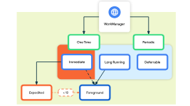

# Work Manger

**Persistent work**: Task which are scheduled through app restart/ reboot , which accomplishes background task very efficiently. And `Work Manager` is recommended to do Persistent work in Android

### Types of persistent work

- **Immediate:** start Immediate and end soon. may be expedited
- **Long Running:** 

